# FlowForge

Visual PLC programming platform for Beckhoff TwinCAT. Provides a web-based node editor — inspired by Unreal Engine Blueprints — for creating, building, and deploying PLC projects without writing Structured Text by hand.

> **Status**: Architecture and technology stack finalized. Implementation not yet started.

## Architecture



| Component | Technology | Role |
|-----------|-----------|------|
| **Frontend** | React, React Flow, TypeScript | Node-based visual editor, login, monitoring UI |
| **Backend** | ASP.NET Core, PostgreSQL, EF Core, SignalR, MQTTnet, LibGit2Sharp | Project management, build queue, deploy orchestration, git operations, user admin (via Keycloak API), monitor container lifecycle |
| **Keycloak** | Keycloak (OIDC/SAML) | Authentication & authorization — local users, LDAP federation, external SSO. Backend validates JWT only. Admin UI in frontend via Keycloak Admin REST API |
| **Build Server** | C#/.NET, Beckhoff Automation Interface | Generates TwinCAT solution from flow JSON, compiles, commits to repo, deploys (activates) on target PLC via ADS over MQTT. One instance per TwinCAT version on dedicated Windows Server |
| **Monitor Server** | C#/.NET, SignalR, MQTTnet | On-demand container — reads PLC variables via ADS over MQTT, streams live data directly to frontend. Backend manages lifecycle only |

Full architecture documentation: [doc/ARCHITECTURE.md](doc/ARCHITECTURE.md)

## Key Design Decisions

- **Git as single source of truth** — each project is a GitHub repo containing flow JSON and generated PLC solution. PostgreSQL stores metadata, auth, and audit only.
- **User identity for git operations** — users commit/push with their own credentials. Service user handles repo creation only.
- **Build/Deploy separation with permission hierarchy** — Deploy implies Build. Deploy button runs Build then Deploy sequentially. Both executed by the build server (requires TwinCAT Engineering for PLC activation). Backend orchestrates, build server executes.
- **ADS over MQTT** — PLC communication (deploy, activate, monitor) through a central MQTT broker. Free, no per-server ADS route configuration.
- **On-demand monitoring** — monitor containers stream ADS data directly to the frontend via SignalR, bypassing the backend data path.

Decision rationale and alternatives evaluated: [doc/DECISION_LOG.md](doc/DECISION_LOG.md)

## Project Structure

```
src/
├── frontend/         React + React Flow visual editor
├── backend/          ASP.NET Core API server
├── build-server/     PLC build server (C#/.NET)
└── monitor-server/   On-demand PLC monitoring containers (C#/.NET)
doc/                  Architecture, decisions, specifications
samples/              Example visual programs
test/                 Unit and integration tests
```

## Getting Started

**Prerequisites**: Git, Node.js 18+ (for commit validation tooling)

```bash
git clone <repository-url>
cd FlowForge

# Linux/macOS
./scripts/setup-dev.sh

# Windows (PowerShell)
.\scripts\setup-dev.ps1
```

The script configures the commit message template, installs commitlint + husky, and sets up git hooks.

See [QUICKSTART.md](QUICKSTART.md) for detailed setup instructions.

## Development Workflow

This project uses [GitFlow](doc/GIT_WORKFLOW.md) branching and [Conventional Commits](https://www.conventionalcommits.org/).

```bash
git checkout develop
git checkout -b feature/your-feature-name

# commit messages are validated by commitlint
git commit -m "feat(frontend): add timer node to node library"
```

Scopes: `frontend`, `backend`, `build-server`, `monitor-server`, `docs`, `config`, `deps`

See [CONTRIBUTING.md](CONTRIBUTING.md) for full guidelines.

## Documentation

| Document | Description |
|----------|-------------|
| [ARCHITECTURE.md](doc/ARCHITECTURE.md) | System architecture, component interaction, data flow |
| [DECISION_LOG.md](doc/DECISION_LOG.md) | Technology and design decisions with rationale |
| [TECH_DECISIONS.md](doc/TECH_DECISIONS.md) | Technology evaluation and comparison |
| [VISUAL_LANGUAGE.md](doc/VISUAL_LANGUAGE.md) | Node types, ports, connection rules, type system |
| [GIT_WORKFLOW.md](doc/GIT_WORKFLOW.md) | GitFlow branching, Conventional Commits, PR guidelines |
## Roadmap

Development planning is tracked via GitHub [Milestones](https://github.com/qubernetic-org/FlowForge/milestones) and [Issues](https://github.com/qubernetic-org/FlowForge/issues).

## License

Copyright (c) 2026 Qubernetic (Biró, Csaba Attila)

This project is dual-licensed:

- **Open Source**: [GNU Affero General Public License v3.0](LICENSE) — free to use, modify, and distribute under AGPL-3.0 terms
- **Commercial**: A proprietary license for use cases incompatible with AGPL-3.0 is available from [Qubernetic](mailto:csaba.biro@qubernetic.com)

See [NOTICE](NOTICE) for details.
